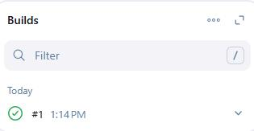
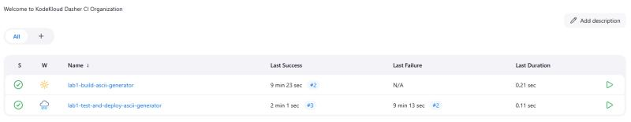

# Jenkins
 CI/CD Pipeline Automation 

## Scope
This project covers a series of operational Jenkins tasks. Each step includes screenshots, the commands used, and an explanation of the task's purpose. The focus areas include Groovy scripting for Jenkinsfile creation, troubleshooting and modification, front-end install, authorization and access controls, freestyle project creation and troubleshooting, CI/CD pipeline creation and troubleshooting, and SCM file management.

## Environment
- Jenkins (CI/CD Pipeline Management/Automation)(Front-end GUI)
- GitTea (SCM/VCS)
- Groovy scripting (Jenkinsfile authorship)
- Operating System: Ubuntu 22.04.5 LTS
- Jenkinsfiles for free project and pipeline automation

## Tasks
### Install Jenkins on the host, validate install completed.

### Install required JDK pre-requisite and confirmed running on the host.

### Set Jenkins to start at host boot, confirm running on port 8085 from default port of 8080, start the daemon.

### Confirm version of installed JDK, and that the Jenkins daemon is running with no issues.

### Create initial test script, chmod permissions to 755, test script and confirm it is functional.

### Obtain default admin password for initial login to GUI.

### Confirm GUI resolves, login with initial admin token, create first user in engine.

### Install plugins, review failures and errors, continue on as troubleshooting failures is outside of the scope of this project.

### Create freestyle project, run the project, confirm completed without issue.

### Execute first freestyle project, review script output, confirm returned as expected and no errors observed.

### Validate first freestyle project build history and confirm matches expected output.

### Build two freestyle projects, second one is a dependancy of the first project, validate first run both triggered the second and neither returned any issues.

### Install the Copy Artifact plugin and validate completed without issue.

### Run both freestyle projects after plugin installation asnd confirm both complete without issue.

### Set the system message as well as the number of executors. 

### Define number of the executors on the host.

### Create multi-step pipelin3, install the Copy Artifact plugin, configure the build parameters, modify the build steps, run the job, confirm the artifact was copied and that all jobs completed without error.

### Validate secondary job ran after confirming the first job in the pipeline completed succesfully.

### Create pipeline, launch run, confirm run completes without error.

### Create pipeline, troubleshoot issue(s) with Jenkinsfile, push to GitTea, run job again, confirm completes without issue.

### Generate new API token for next pipeline run via curl.

### Kick off pipeline with sleep timer defined via REST API.

