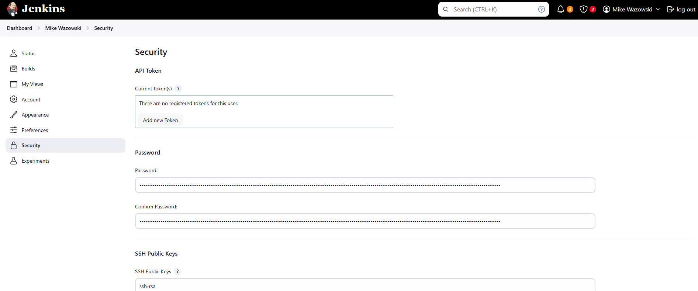

# Jenkins
 Jenkins SysAdmin Tasks

## Scope
This project covers a series of standard Jenkins sysadmin tasks.

## Environment
- Jenkins (CI/CD Pipeline Management/Automation)(Front-end GUI)(Back-end CLI)
- Groovy scripting (Jenkinsfile authorship)
- Operating System: RHEL9
- Jenkinsfiles for free project and pipeline automation

## Tasks
### Validate configured users that may login to the GUI.

### Confirm user account does not have public SSH key configured.

### Obtain public SSH key from CLI for user.

### Add key to user account in the GUI.

