# Jenkins
 Jenkins SysAdmin Tasks

## Scope
This project covers a series of standard Jenkins sysadmin tasks.

## Environment
- Jenkins (CI/CD Pipeline Management/Automation)(Front-end GUI)(Back-end CLI)
- Groovy scripting (Jenkinsfile authorship)
- Operating System: RHEL9
- Jenkinsfiles for free project and pipeline automation

## Tasks
### Validate configured users that may login to the GUI.
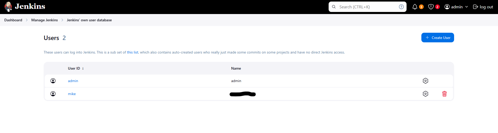

### Confirm user account does not have public SSH key configured.
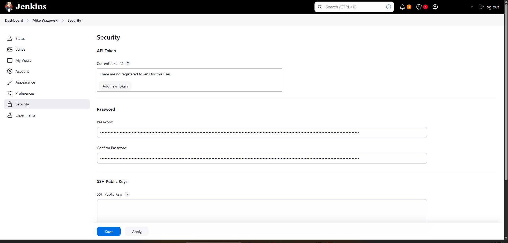

### Obtain public SSH key from CLI for user.
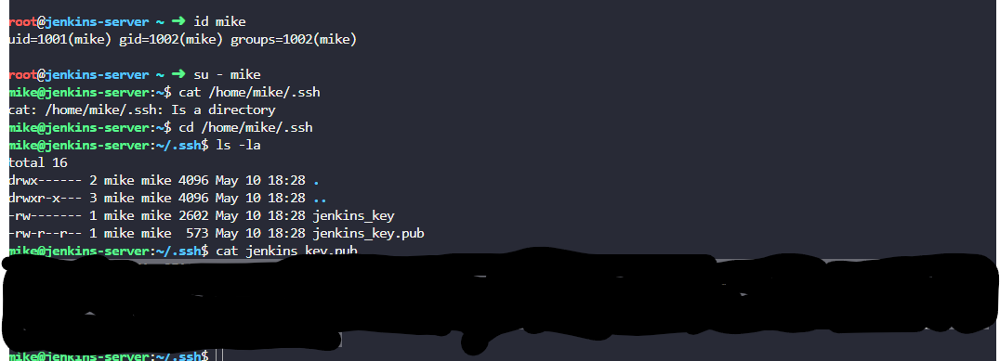

### Add key to user account in the GUI.
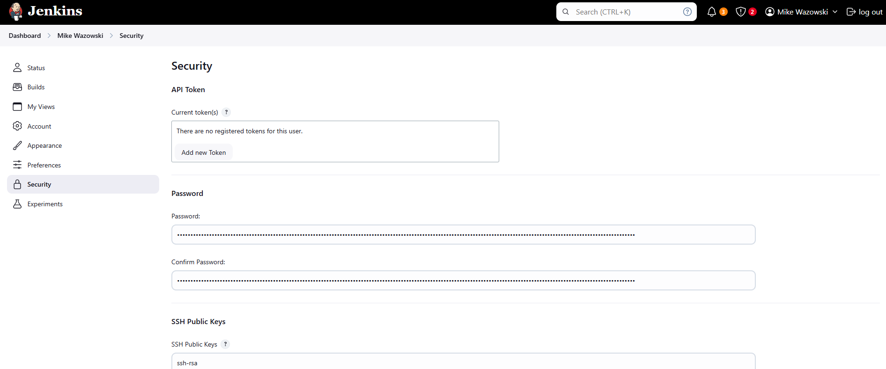

### Installed GitHub plugin via GUI.
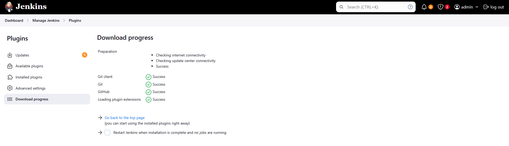

### Restart Jenkins front-end via CLI.
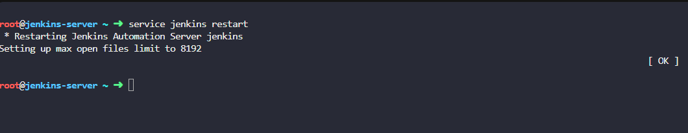

### Update AWS batch plugin utilizing GUI.
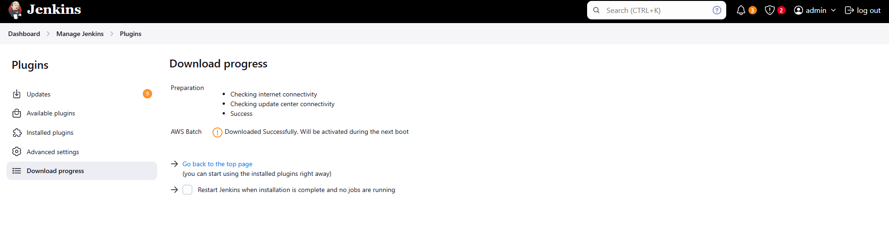

### Validate update of plugin by checking on the host utilizing CLI.
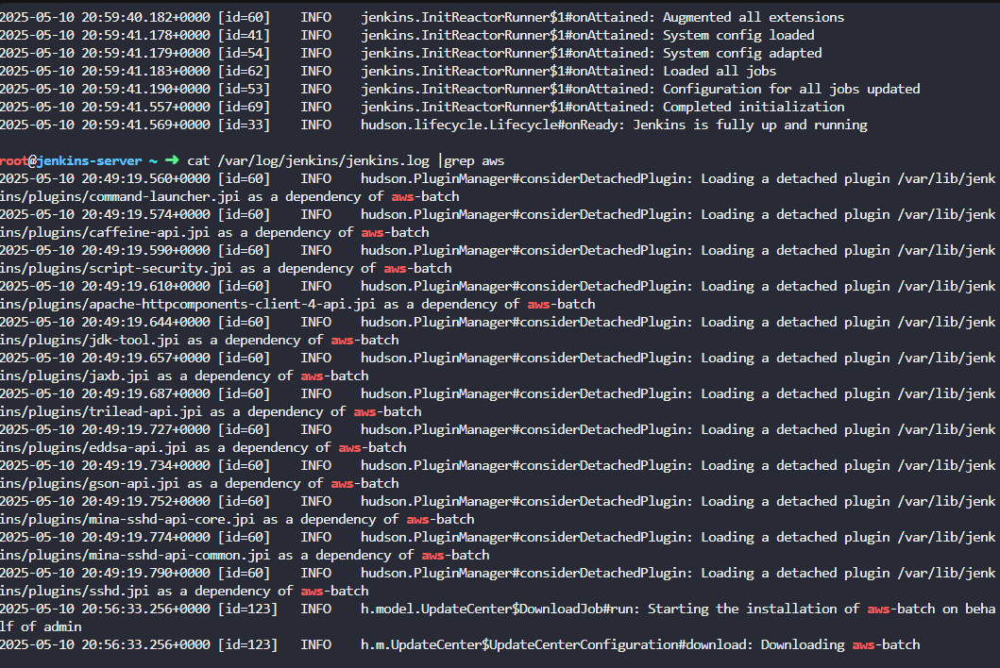

### Uninstall AWS batch plugin via GUI.
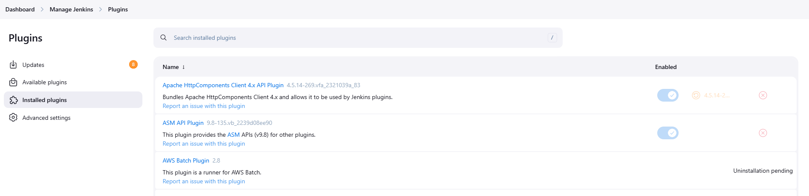

### Install plugin via CLI.
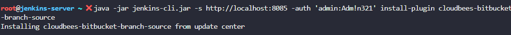

### List installed plugins, source and version on host using the CLI.
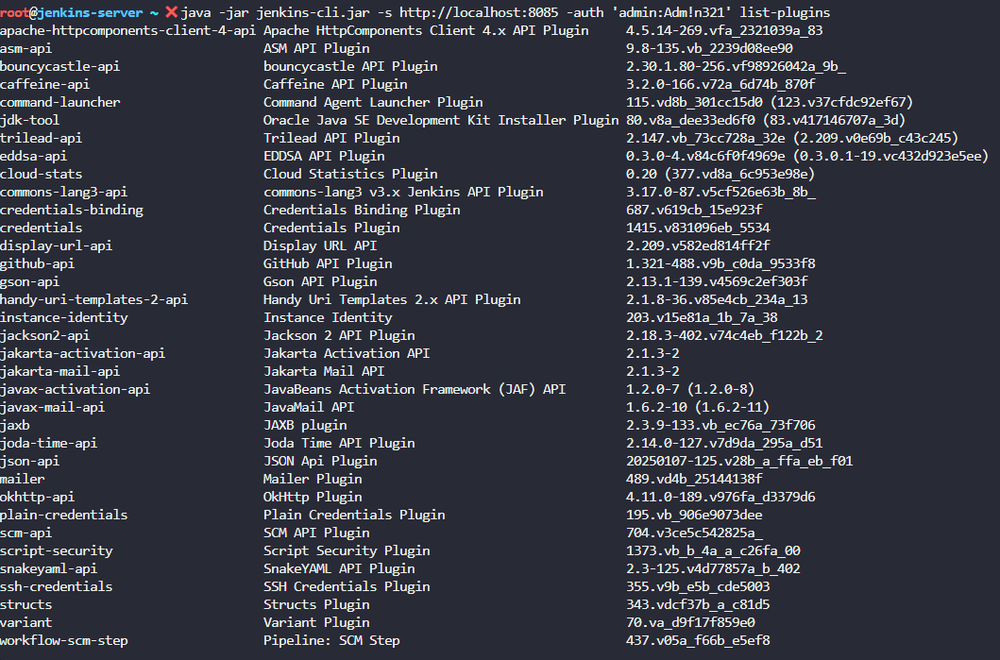

### Disable and enable a plugin using the CLI.

### Create user using the GUI.
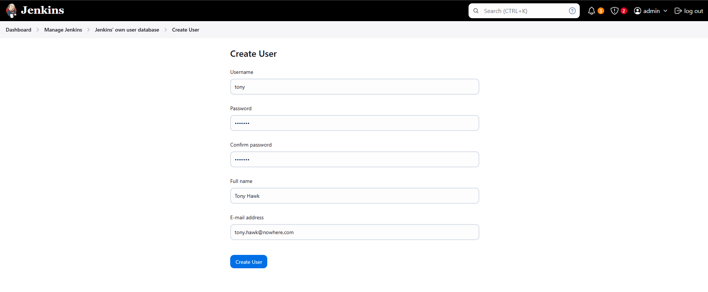

### Install Role-Based authorization strategy plugin using the GUI.
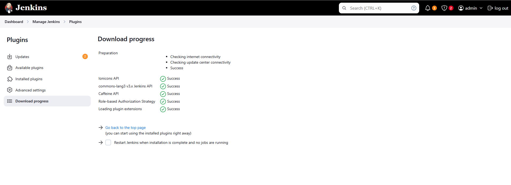

### Enable Role-Based strategy authorization schema in the GUI.
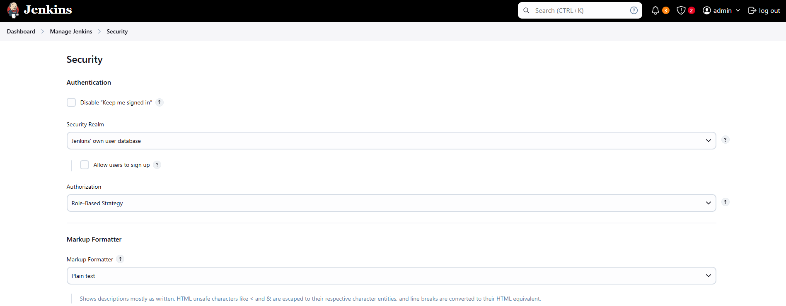

### Create developers role and assign overall Read only permissions in the GUI.
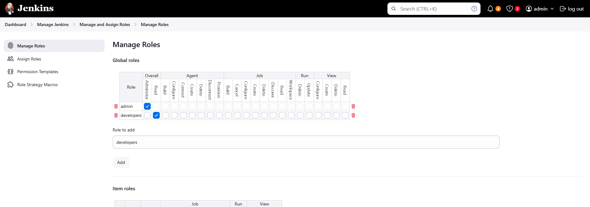

### Assign permissions to Tony using PAM in the GUI.
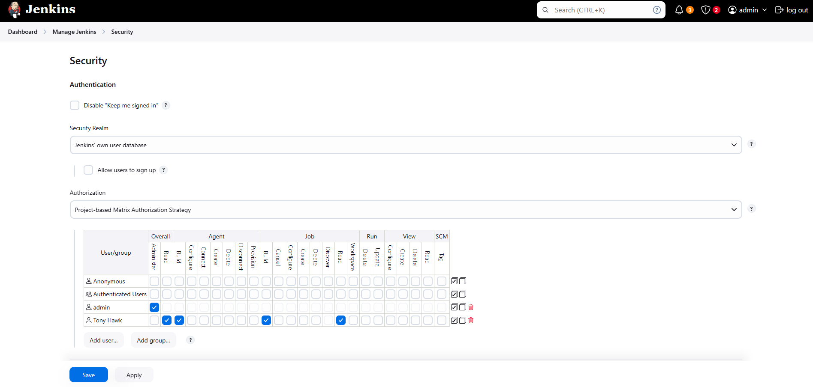

### Assign new created user to the dev group.
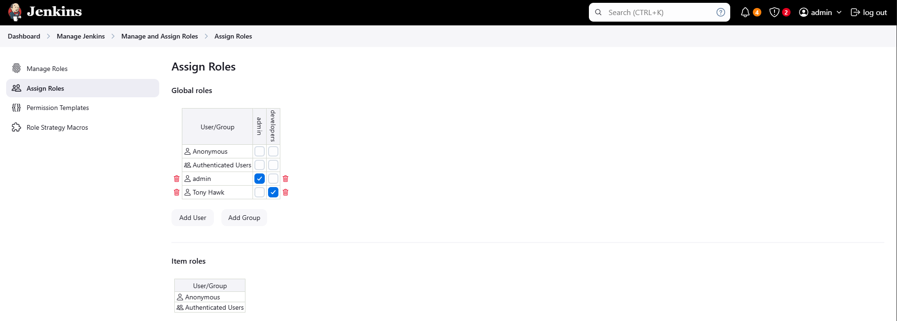

### Install the Matrix Authorization Strategy plugin in the GUI.
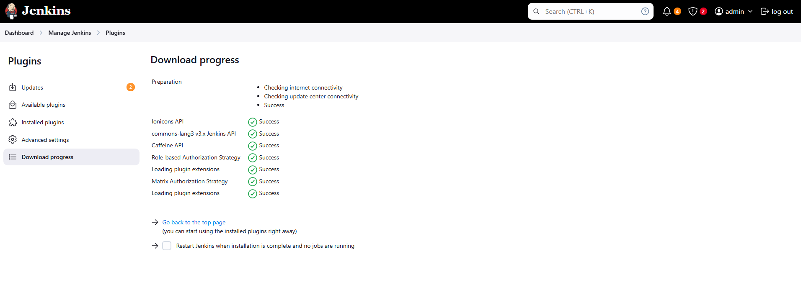
