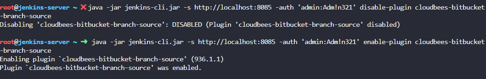
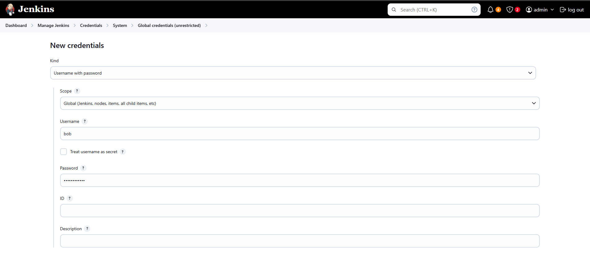

# Jenkins
 Jenkins SysAdmin Tasks

## Scope
This project covers a series of standard Jenkins sysadmin tasks.

## Environment
- Jenkins (CI/CD Pipeline Management/Automation)(Front-end GUI)(Back-end CLI)
- Groovy scripting (Jenkinsfile authorship)
- Operating System: RHEL9
- Jenkinsfiles for free project and pipeline automation

## Tasks
### Validate configured users that may login to the GUI.

### Confirm user account does not have public SSH key configured.

### Obtain public SSH key from CLI for user.

### Add key to user account in the GUI.

### Installed GitHub plugin via GUI.

### Restart Jenkins front-end via CLI.

### Update AWS batch plugin utilizing GUI.

### Validate update of plugin by checking on the host utilizing CLI.

### Uninstall AWS batch plugin via GUI.

### Install plugin via CLI.

### List installed plugins, source and version on host using the CLI.

### Disable and enable a plugin using the CLI.

### Create user using the GUI.

### Install Role-Based authorization strategy plugin using the GUI.

### Enable Role-Based strategy authorization schema in the GUI.

### Create developers role and assign overall Read only permissions in the GUI.

### Assign permissions to Tony using PAM in the GUI.

### Assign new created user to the dev group.

### Install the Matrix Authorization Strategy plugin in the GUI.

### Create list view in the GUI.

### Confirm the run history of a specific job in the GUI.

### Change the number of executors from 2 to 4 in the GUI.

### Add automatic install of Maven version and specify the version number.

### Change the SCM checkout counter.

### Install ThinBackup plugin.

### Run backup using the ThinBackup plugin and validate backup present on the host in the backup directory.

### Testing backup restore using the ThinkBackup plugin in the GUI.

### Testing backup restore using the ThinkBackup plugin in the GUI.

### Install the Promethius metrics plugin.

### Add Jenkins job to the Promethius YAML file on the host.

### Confirm the Jenkins target is up in Promethius after cleaning up the scrape YAML config.

### Run the Jenkins job count query in Promethius after adding the target.

### Configure the Jenkins Default Dashboard in Grafana.

### Create hello-world test job, run and ensure that it completes succesfully. 

### Add steps to clone the git repo and run the test script.

### Confirm the go-test job ran without issue.

### Install the SSH build-agents plugin via the GUI.

### Create new user account in the GUI via the credentials option.

### Create node via node options in the GUI.

